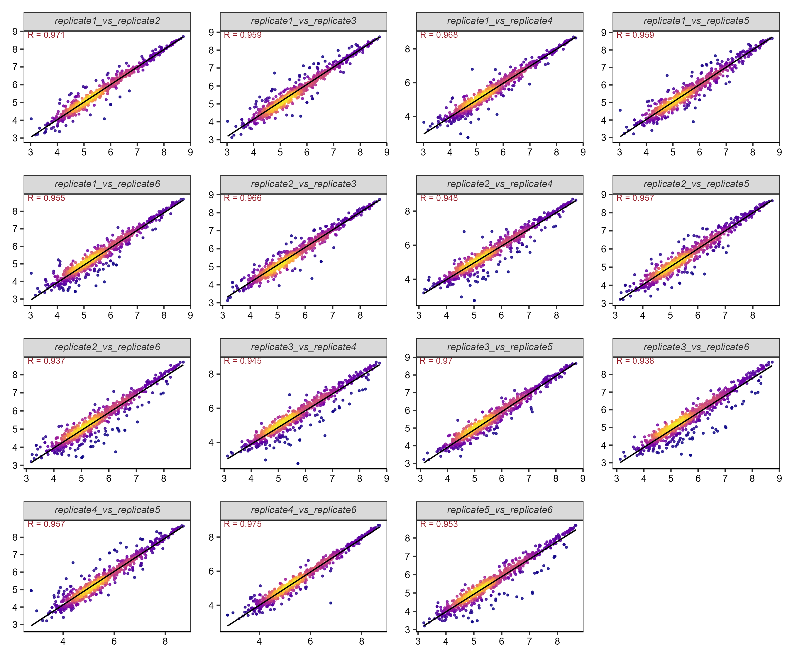
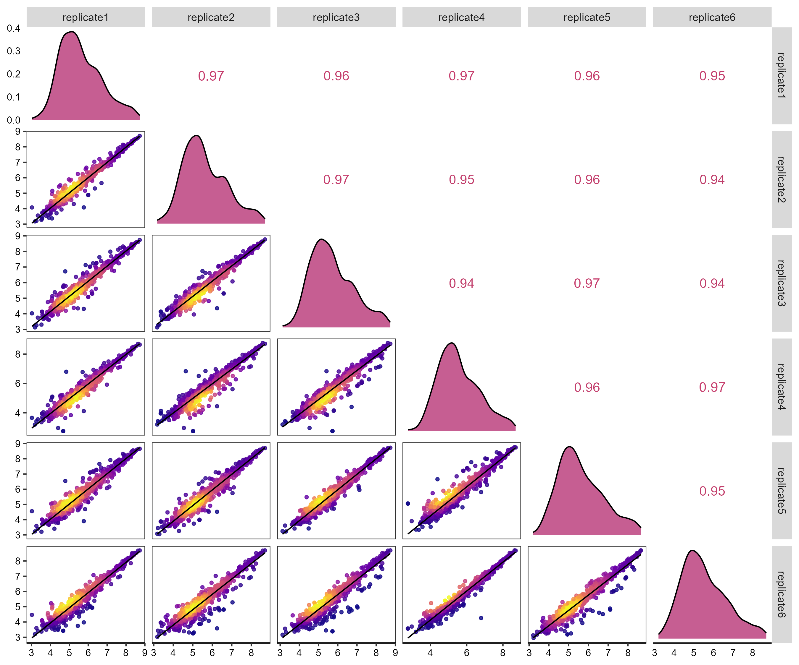

```{r setup, include=FALSE}
knitr::opts_chunk$set(echo = TRUE)
```

## corhex

corhex is an R package for generating correlation hexagon plots. It helps you quickly visualize correlations between multiple groups within the R environment, particularly suited for large-scale datasets.

## Installation

```{r}
if(!require(devtools)){install.packages("devtools")}
if(!require(spatstat.geom)){install.packages("spatstat.geom")}#dependency package
# Install corHex package from GitHub
devtools::install_github("Chuanping-Zhao/corhex")
```

## Example Data

Loading example data:

```{r}
library(corhex)
data("demo", package = "corhex")
DT::datatable(demo)
```

## Using the cor_hex Function

```{r}
result=cor_hex(dt=demo,
               id.col="Index",
               cor.method=c("pearson", "kendall", "spearman")[3],
               savefile="outputfile",
               singleplotsize=c(3,2.5),
               facetplotsize=c(3*3,2.5*3),
               bin=50,#Number of bins for hex plot. Default is 50.
               logL=FALSE,#Whether to log-transform the data (log10). Default is TRUE.
               pointcolor=c("A","B","C","D","E")[3],#Color scheme for density point plots. Options include "A", "B", "C", "D", "E". Default is "C".
               pointsize=0.5,#Size of points in density point plots. Default is 0.5
               kde2d.n=50,#Grid size for kernel density estimation using `MASS::kde2d`. Default is 50.
               plottype=c("hex","point")[2],#Type of plot to generate: "hex" for hexagon plots, "point" for density point plots. Default is "point"
                smooth.color = "black",
                smooth.width = 0.5,
                savePPT = FALSE
               )
```



## Using the corpairs Function

```{r}
corpairs(dt=demo,
         id.col="Index",
         cor.method=c("pearson", "kendall", "spearman")[3],
         savefile="Figure",
         corpairplotsize=c(3*3,2.5*3),#width height
         bin=50,
         logL=FALSE,
         plottype=c("hex","point")[2],
         pointcolor=c("A","B","C","D","E")[3],
         pointsize=1,
         kde2d.n=50,
         smooth.color = "black",
         smooth.width = 0.5,
         savePPT = FALSE,
        density.color = "#B83677"
         )
```

